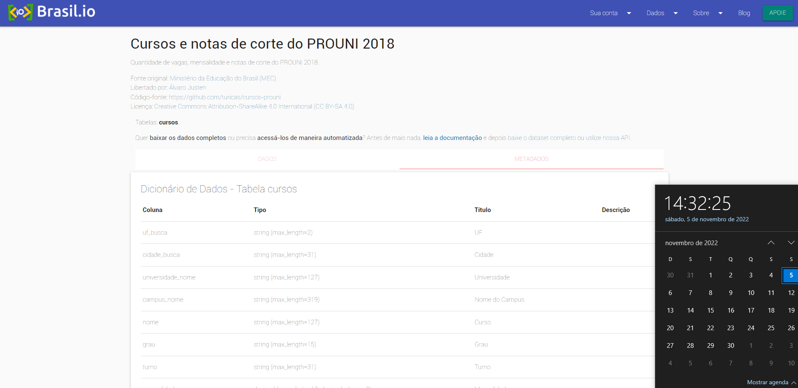

  

  <h3 align="center">
    cursos-prouni
  </h3>
  

    <a href="https://github.com/viniciusgugelmin/data-science-2/blob/master/README.md"><strong>Explore the docs »</strong></a>
  

  
<h2 style="display: inline-block">📜 Abstract</h2>

- [About The Project](#about-the-project)
- [Source](#source)

## 📋 About The Project

**(Portuguese)**

Quantidade de vagas, mensalidade e notas de corte do PROUNI 2018.

**(English)**

Number of vacancies, monthly fee and cut-off marks of PROUNI 2018.

## 🔗 SOURCE

**(Portuguese)**

- **Nome original do projeto**: Cursos e notas de corte do PROUNI 2018
- **Disponível em**: https://brasil.io/dataset/cursos-prouni/cursos/
- **Baixado em**: 05/11/2022 14:32:25
- **Imagem**:
  

**(English)**

- **Original project name**: PROUNI 2018 courses and cut-off notes
- **Available at**: https://brasil.io/dataset/cursos-prouni/cursos/
- **Downloaded at**: 11/05/2022 14:32:25
